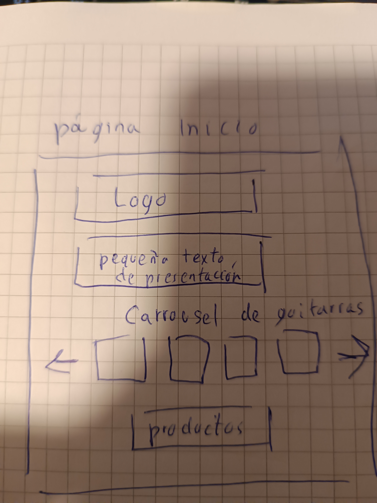
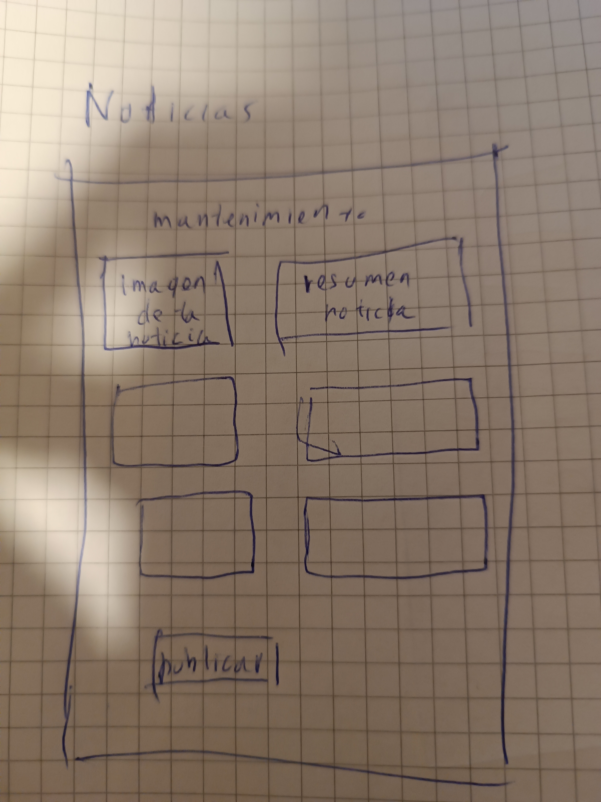
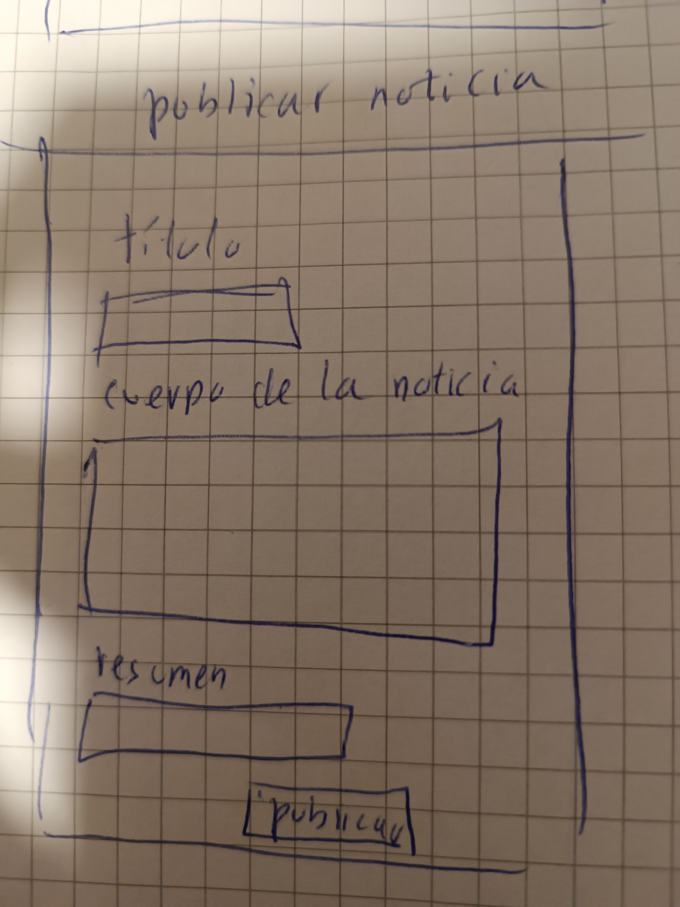
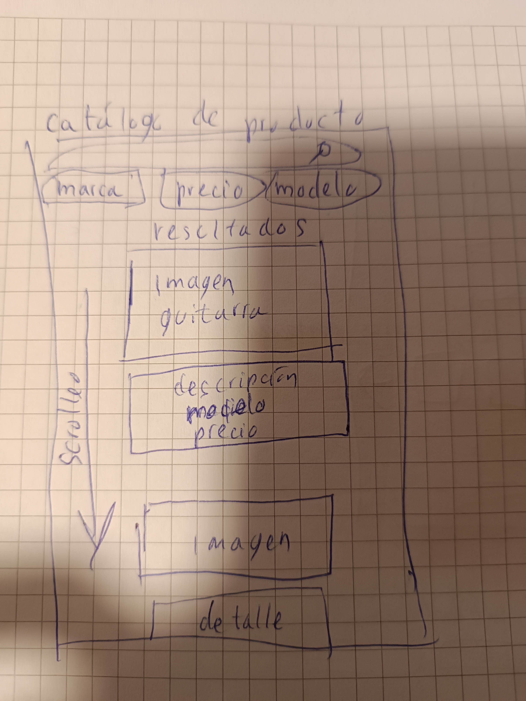
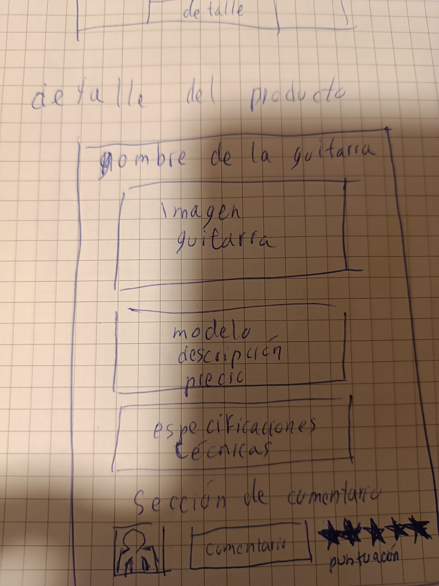
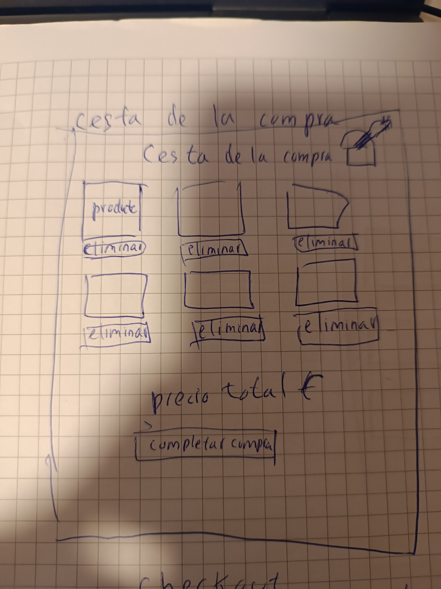
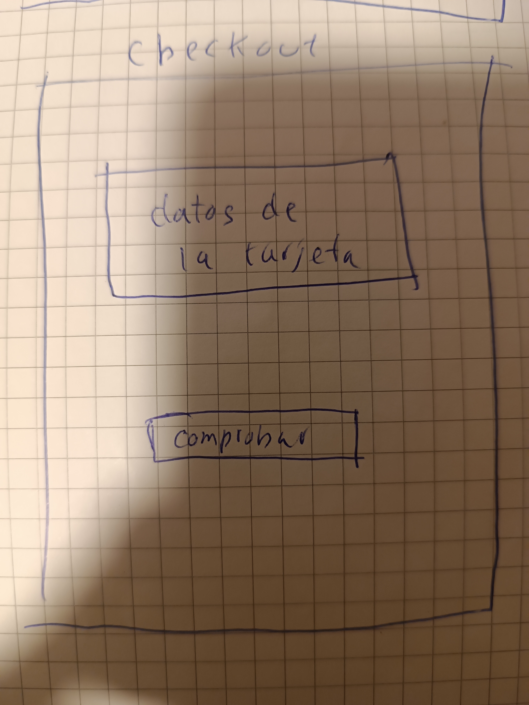
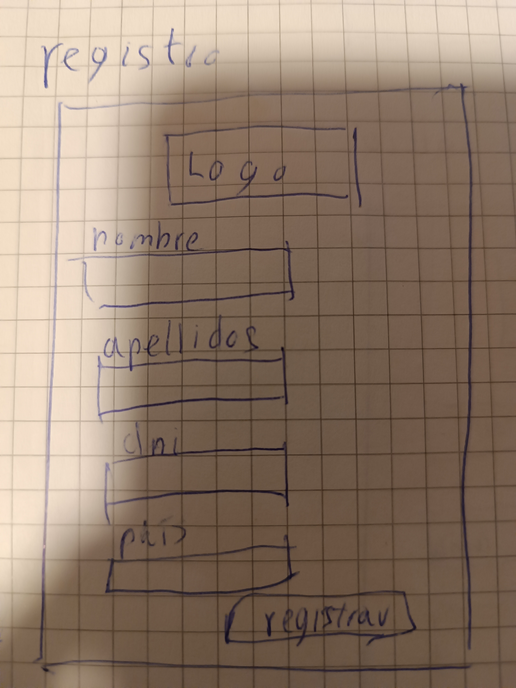

# wireframe

<h1>Pagina de inicio</h1>

<h1>Noticias</h1>

<h1> publicar noticia</h1>

<h1>catálogo del producto</h1>

<h1>detalle del producto</h1>

<h1>cesta de la compra</h1>

<h1>checkout</h1>

<h1>registro</h1>

<h1>login</h1>

